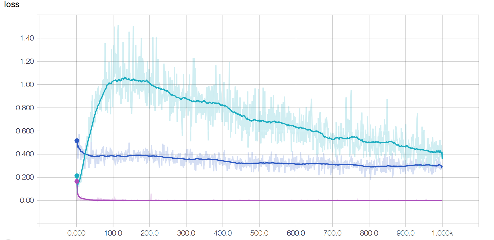

# Improved GAN (Semi-supervised GAN)
This is an implementation of *Semi-supervised generative adversarial network* in the paper [Improved Techniques for Training GANs](https://arxiv.org/abs/1606.03498) for **Mnist** dataset.
This method and its extensions have marvellous performance on traditional CV datasets, and remain state-of-art (by the end of November, 2017).

## Working Principle
Inspired by [Good Semi-supervised Learning that Requires a Bad GAN](https://arxiv.org/abs/1705.09783), semi-supervised GAN with feature matching actually generates unrealistic fake samples around high-density region. With the inborn continuity, the **fake region** in feature space split the bounds of different classes.

Refer to [Semi-supervised Learning on Graphs with Generative Adversarial Nets](https://arxiv.org/abs/1809.00130) for more details about this **density gap splitting** explaination.

## Running 
The code was implemented in Python 3.7.

`python ImprovedGAN.py` 

Default configs include **CPU, saving and autoloading, generating logfile in tensorboard format, etc**. You can use `python ImprovedGAN.py --cuda` to run it on GPU.

The **latest** `torch`(1.2 version), `tensorboardX`, `torchvision` are needed.

## Result
Default configs can train models achieving **98.5% accuracy** on test dataset with 100 labeled data(10 per class) and other 59,000 unlabeled data after 100 epochs.
### Loss curve during training

`loss_label => red, loss_unlabel => blue, loss_gen => green`
 

It must be noted that [OpenAI implementation](https://github.com/openai/improved-gan)(theano) demonstrates a different curve, where loss\_gen is nearly zero and loss\_unlabel increase gradually.
 
## Remark
* The implementation is based on [OpenAI implementation](https://github.com/openai/improved-gan). 
* But I found it hard to reproduce expected results and suffered from exploding gradients. I changed the final layer in generator from **Sigmoid** to **Softplus**, and therefore fixed it.
* `./models` includes the trained model, you can simply delete it for retraining.
* The archectures of networks are elaborately designed, among them `Weight Normalization` is very important.
* Thank Jiapeng Hong for discussing with me.

## Change Logs
* (Nov 27, 2019) Update to pytorch 1.2 and Python 3.7. The version for pytorch 0.3 and Python 2.7 can be found in the history versions. Delete pretrained models.
